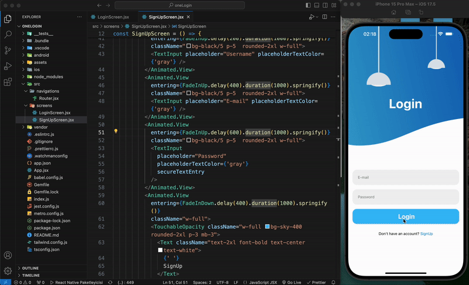

# React Native Navigation Project

This project is a simple React Native application featuring two primary screens: Login and ScreenPage. Users can navigate between these two screens. The Login and SignUp functionalities have not yet been integrated. Additionally, the project utilizes nativewind and react-native-reanimated libraries to enhance styling and animations.

## Video gif



### Table of Contents

- Features
- Technologies and Libraries Used
- Installation
- Contributing
- Contact

## Features

- Login Screen: Allows users to input their credentials (functionality not yet integrated).
- ScreenPage: The main screen users are navigated to after logging in.
- Navigation: Utilizes React Navigation to facilitate transitions between screens.
- Styling: Managed using nativewind for Tailwind CSS-like utility classes.
- Animations: Enhanced with react-native-reanimated for performant animations.

## Technologies and Lİbraries Used

- React Native
- React Navigation
- @react-navigation/native
- @react-navigation/native-stack
- NativeWind
- React Native Reanimated
- JavaScript

## Installation

- Clone the project to your local machine:
  git clone https://github.com/ozerbaykal/react-native-navigation-project-.git

- Navigate to the project directory:

```
cd react-native-navigation-project
```

- Install the necessary packages:

```
npm install
```

- Additional Steps

For iOS(optinal)
If you intend to run the project on an iOS device or simulator, you need to install CocoaPods dependencies.

```
cd ios
pod install
cd ..

```

Note: Ensure that you are using a macOS system with Xcode installed.

## Running the Project

You can run the React Native application using the following commands:

### Android

```
npm run android

```

### iOS

```
npm run ios

```

### Starting the Development Server

```
npm start

```

<h2>Contributing</h2>

Contributions are welcome! Please open an issue first to discuss what you would like to change.

- 1.Fork the project
- 2.Create your feature branch (git checkout -b feature/NewFeature)
- 3.Commit your changes (git commit -m 'Add new feature')
- 4.Push to the branch (git push origin feature/NewFeature)
- 5.Open a Pull Request

<h2>Contact</h2>

Özer BAYKAL mail : baykalozer87@gmail.com

Project Link: https://github.com/ozerbaykal/react-native-navigation-ptoject
